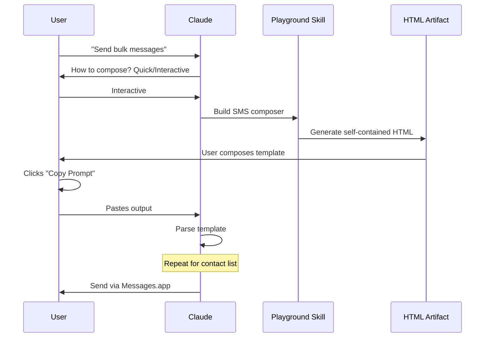

# Bulk Messenger Desktop

**Bulk messaging plugin for Claude Desktop** - Compose and send personalized SMS messages to multiple contacts using interactive playground artifacts.

This plugin is specifically designed for **Claude Desktop's VM environment** where traditional server-based workflows are not possible. It uses the [playground skill pattern](https://github.com/anthropics/claude-plugins-official/tree/main/plugins/playground) to generate self-contained HTML artifacts for composing templates and managing contact lists.

## Features

- **SMS Template Composer** - Interactive playground for creating message templates with `{{variable}}` placeholders
- **Contact List Manager** - Build contact lists with CSV import or manual entry
- **Phone Validation** - Automatic validation of phone numbers (E.164 and US 10-digit formats)
- **Variable Replacement** - Personalized messages for each recipient
- **Messages.app Integration** - Direct sending via macOS Messages app (when accessible)
- **No Persistent Storage** - Each session is independent (Claude Desktop VM-compatible)

## Prerequisites

- **Claude Desktop** (this plugin is designed for the VM environment)
- **macOS** with Messages.app installed (for sending)
- Messages.app configured with Apple ID and SMS capability
- The **playground skill** (from Anthropic's official plugins, or bundled with this plugin)

## Installation

1. Clone or download this plugin to your Claude Desktop plugins directory:

```bash
cd ~/.claude/plugins
git clone <this-repo-url> bulk-messenger-desktop
```

Or copy the `bulk-messenger-desktop` directory to your plugins folder.

2. Restart Claude Desktop to load the plugin.

3. Verify installation:

```
/plugin list
```

You should see `bulk-messenger-desktop` in the list.

## Quick Start

1. **Trigger the skill:**

```
Send bulk SMS to my contacts
```

2. **Compose your template:**
   - Choose "Interactive" to open the visual composer (recommended)
   - Or choose "Quick" to type the template in chat
   - Use `{{variable}}` syntax for personalization: `Hi {{name}}, ...`

3. **Build your contact list:**
   - Choose "Interactive" to open the list manager (recommended)
   - Or choose "Quick" to paste CSV/JSON data in chat
   - Required field: `phone_number` (all others optional)

4. **Review and send:**
   - Preview personalized messages for each recipient
   - Send via Messages.app (or copy for manual sending)

## How It Works

Unlike traditional plugins that use a Python server, this plugin uses **playground artifacts** to provide interactive interfaces:



### The Playground Pattern

1. **Template Definitions** - Markdown files in `skills/playground/templates/` describe how to build each interactive page
2. **HTML Generation** - Claude reads the template definition and generates a self-contained HTML file
3. **User Interaction** - The HTML artifact opens in a browser/viewer where users compose their content
4. **Copy-Paste Return** - Users click "Copy Prompt" to copy structured output, then paste it back to Claude
5. **Parsing** - Claude parses the natural-language output to extract structured data

This pattern works in Claude Desktop's VM where traditional localhost servers cannot run.

## Usage Examples

### Example 1: Holiday Greeting Campaign

**Template:**
```
Hi {{name}}, happy holidays from {{company}}! Enjoy {{discount}}% off your next order. Valid until {{expiry}}.
```

**Contacts (CSV):**
```csv
phone_number,name,company,discount,expiry
+15551234567,John,Acme Corp,20,Dec 31
+15559876543,Sarah,Tech Inc,15,Dec 31
+15555551234,Mike,Design Co,25,Dec 31
```

**Result:** 3 personalized SMS messages, each with the recipient's name, company, discount, and expiry date.

### Example 2: Appointment Reminders

**Template:**
```
Reminder: {{name}}, you have an appointment for {{service}} on {{date}} at {{time}}. Reply C to confirm.
```

**Contacts (Interactive Entry):**
- +15551234567, John, Haircut, Dec 15, 2:00 PM
- +15559876543, Sarah, Consultation, Dec 16, 10:00 AM

**Result:** Personalized appointment reminders with service type, date, and time for each contact.

## File Structure

```
bulk-messenger-desktop/
├── .claude-plugin/
│   └── plugin.json              # Plugin manifest
├── skills/
│   ├── send-messages/
│   │   └── SKILL.md             # Main orchestration skill
│   └── playground/
│       ├── SKILL.md             # Playground skill (adapted from Anthropic)
│       └── templates/
│           ├── sms-composer.md  # SMS template composer definition
│           └── preview.md       # Message preview definition
├── LICENSE
└── README.md
```

## Differences from bulk-messenger-minimal

This plugin is adapted from [bulk-messenger-minimal](../bulk-messenger-minimal/) for Claude Desktop compatibility:

| Feature | bulk-messenger-minimal | bulk-messenger-desktop |
|---------|------------------------|------------------------|
| Environment | Claude Code (local) | Claude Desktop (VM) |
| Interactive UI | Python HTTP server :8787 | Playground artifacts |
| Data return | POST to server | Copy-paste prompt output |
| Persistent storage | Yes (`logs/*.json`) | No (session-independent) |
| Agents | Yes (server lifecycle) | No (direct skill invocation) |
| Hooks | Yes (auto-start server) | No (no server to manage) |
| Template sidebar | Yes (saved templates) | No (no persistence) |

## Phone Number Formats

Both formats are supported:

- **E.164 International**: `+15551234567` (recommended)
- **US 10-digit**: `5551234567`

Phone numbers are automatically cleaned (spaces, dashes, parentheses removed) before validation.

## Troubleshooting

### "Playground skill not found"

Ensure the playground skill is installed:
- Check `~/.claude/plugins/` for official plugins
- Or verify this plugin's `skills/playground/SKILL.md` exists

### "Messages.app not accessible"

In Claude Desktop's VM, Messages.app may not be accessible. The plugin will detect this and provide formatted messages for manual sending.

### "Invalid phone number"

- Use E.164 format: `+15551234567`
- Or US 10-digit: `5551234567`
- Remove letters and special characters (except + prefix)

### "Variable not replaced"

- Variable names are case-sensitive: `{{name}}` ≠ `{{Name}}`
- Ensure contact data includes all variables from the template
- Check for typos in variable names

### "Playground artifact won't open"

- Try the "Quick" method instead (type/paste in chat)
- Check that template files exist in `skills/playground/templates/`

## Privacy & Rate Limiting

- **No logging** - Messages are sent immediately with no persistent storage
- **User confirmation** - Preview shown before sending
- **Carrier limits** - Be mindful of carrier SMS limits (typically 100-200/day)
- **No artificial rate limiting** - Messages send as fast as Messages.app allows

## Contributing

This plugin is part of the claude-plugins-dev warehouse. Contributions welcome:

1. Fork the repository
2. Create a feature branch
3. Submit a pull request

## License

MIT License - see [LICENSE](LICENSE) file for details.

## Credits

- Adapted from [bulk-messenger-minimal](../bulk-messenger-minimal/)
- Uses the [playground skill pattern](https://github.com/anthropics/claude-plugins-official/tree/main/plugins/playground) from Anthropic's official plugins
- Design language inspired by the original bulk-messenger aesthetics (burnt orange, olive accent, dark mode)

## Support

For issues or questions:
- Check the [Troubleshooting](#troubleshooting) section
- Review skill documentation in `skills/send-messages/SKILL.md`
- Open an issue in the repository
